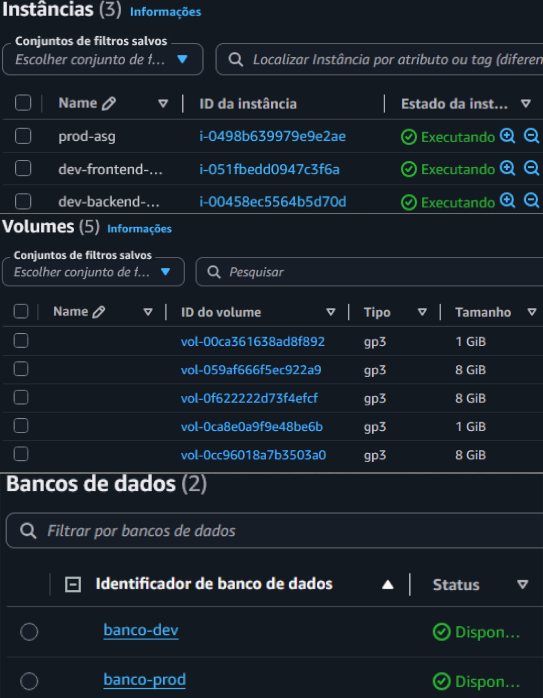
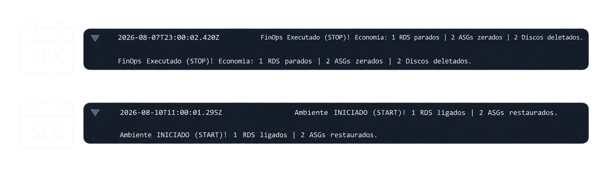

# Projeto FinOps AWS: Redução Automática de Custos

> **Desafio de Negócio:** Reduzir o desperdício financeiro na nuvem automatizando o desligamento de ambientes de Desenvolvimento fora do horário comercial, garantindo que o ambiente de Produção permaneça isolado e operando 24/7.

## Arquitetura da Solução

O fluxo de automação é *Serverless* e orientado a eventos:
* **Sexta-feira (20h):** Reduz a capacidade dos servidores (ASG) para zero, pausa o banco de dados (RDS) e exclui discos órfãos (EBS).
* **Segunda-feira (08h):** Restaura a capacidade do ambiente para o início do expediente da equipe de engenharia.

  

## Evidências de Execução

Demonstração do ciclo completo da automação e o impacto direto na infraestrutura:

### 1. Estado Inicial (Horário Comercial)
> Ambiente de Desenvolvimento operando com recursos provisionados (ASG com instâncias ativas, RDS com status *Disponível* e volumes EBS órfãos gerando custos invisíveis).

  

### 2. Observabilidade e Logs (CloudWatch)
> Registros de execução das funções Lambda acionadas pelo EventBridge. Os logs evidenciam a atuação nos recursos de Desenvolvimento via filtro de *tags*, validando a rotina de Stop (Sexta-feira) e Start (Segunda-feira), com destaque para a **exclusão automática de 2 discos EBS órfãos**.

  

### 3. Estado Final (Redução de Custos Aplicada)
> Comprovação da infraestrutura desalocada: Auto Scaling Group com instâncias encerradas, RDS com status *Parado temporariamente* e a limpeza dos volumes EBS confirmada (redução de 5 para 1 volume faturado), mantendo o isolamento seguro da Produção.

  

---

## Destaques Técnicos

A solução foi desenvolvida com foco em automação e segurança:

* **Infraestrutura como Código (IaC):** O provisionamento completo (ambientes e recursos de automação) foi construído utilizando **Terraform**.
* **Isolamento por Tags:** A rotina em Python (Boto3) atua exclusivamente nos recursos mapeados com a tag `ambiente=dev`.
* **Segurança (Least Privilege):** As IAM Roles foram configuradas com políticas restritas, concedendo apenas as permissões necessárias (Stop, Start, Delete) para serviços específicos.
* **Gestão de Desperdício:** O script identifica e exclui proativamente volumes EBS residuais (buscando pelo status da API `available`), mitigando custos invisíveis.
